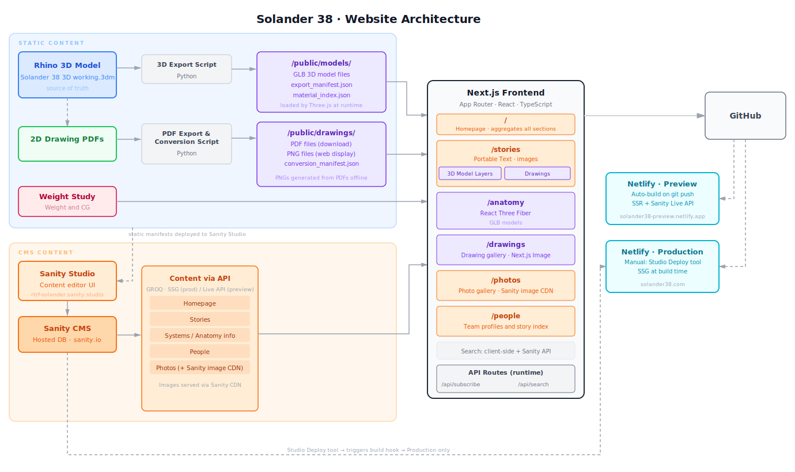

# Solander 38 website
Codebase for both the website CMS and UI/front end. Using https://github.com/sanity-io/sanity-template-nextjs-clean as template.

### CMS (Sanity Studio)
[/studio/](/studio/)

https://rising-tide.sanity.studio

### Front end (Next.js/React)
[/frontend/](/frontend/)

### Python scripts
[/scripts/](/scripts/)

#### 1. `scripts/export-layers-glb.py` 
- Converts Rhino layers to GLB files in `frontend/public/models/`
- Creates `export-manifest.json`
- This must be run inside of Rhino (type `script` to bring up Script Editor)
- Currently requires some manual intervention; when selection dialog appears click Cancel
- ~8 minutes to complete

#### 2. `scripts/pdf-to-png.py`
2a. `pdf-to-png.py`
- Converts all drawing PDFs in `frontend/public/drawings/` to PNGs under `frontend/public/drawings/output_images`
- Original PDF is preserved in the directory
- Creates `export-manifest.json`
- ~90 seconds to complete

2b. `create_material_index.py`
– Extracts material info from glb layers
- Creates `material_index_simple.json`

2c. Copies manifests to sanity directory for Drawing and Material dropdowns
